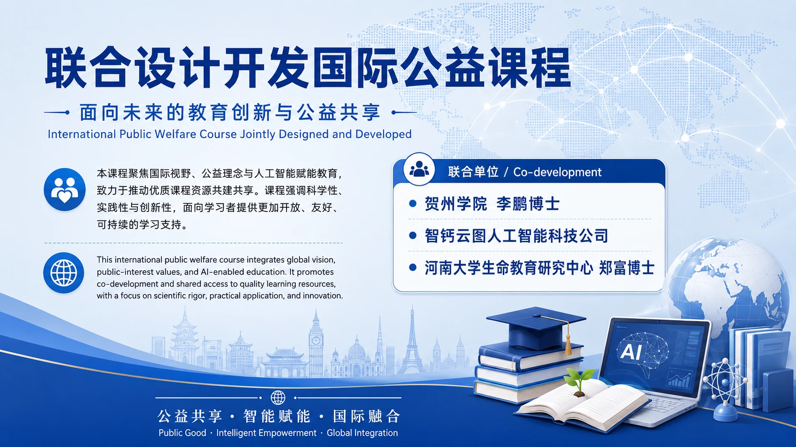

# Polymer Additives Comic Player

这是“高分子材料漫画”的中英文连续播放网页版本。

## 内容

- 49 张 WebP 漫画页
- 49 段中文讲解音频
- 49 段英文讲解音频
- 单页 HTML 播放器，支持连续播放、中文/英文语音切换、字幕显示与关闭、控制区折叠

## 在线访问

GitHub Pages 启用后访问：

https://believe1534892246.github.io/polymer-additives-comic-player/

## 项目背景

本项目可作为国际公益课程设计与共享的一部分展示，联合说明如下：

## 本地预览

直接打开 `index.html` 即可预览。
